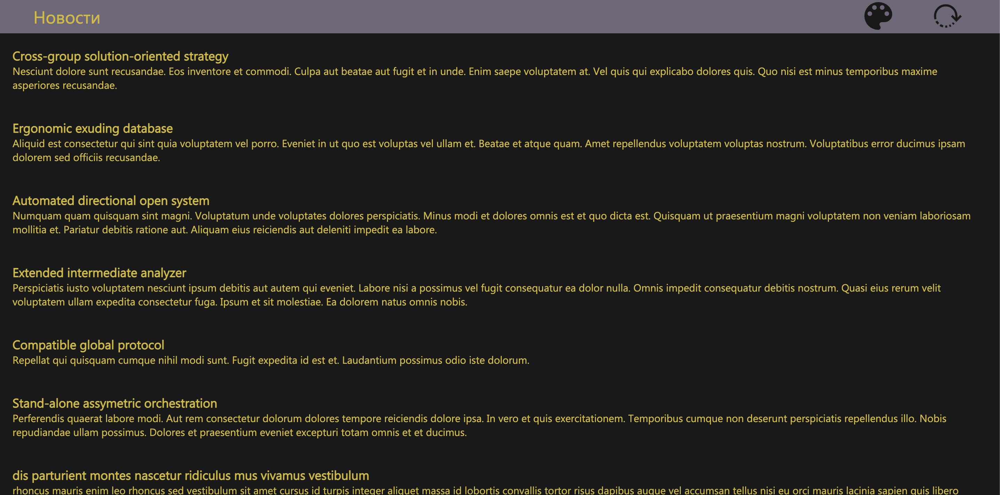
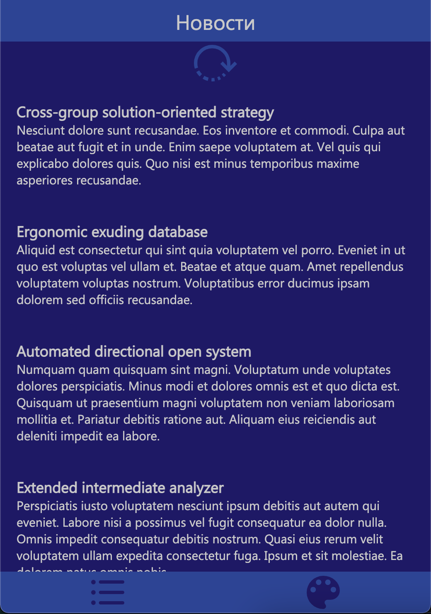
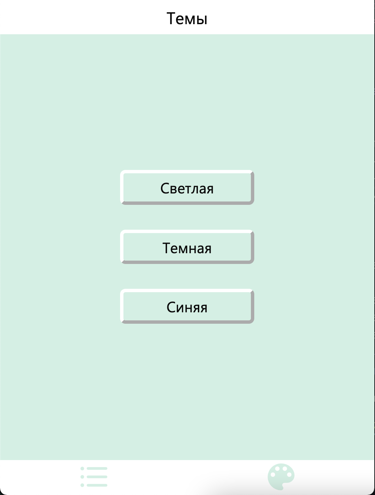

<h1 align="center">"Todo List"</h1>



# Описание

"News App" - это новостная лента, в которой можно менять тему. Данное приложение
использует технологию lazy load, для того чтобы загружать не всю новостную ленту
сразу, а частями. Приложение записывает в _localstorage_ данные о том, какая тема
установлена, какие новости загружены и какая из двух страниц - новостная или
выбора темы открыта.

В мобильной верстке есть возможность перезагрузить новостную ленту с помощью
swipe-to-refresh:



Страница выбора темы:



# Стэк

Приложение создано с помощью create-react-app, используются:

- библиотека react;
- библиотека styled-components;
- библиотека node-sass;
- таблицы стилей SCSS;

# Сборка проекта

```
npm install
npm start
```

# Лицензия

ISC
